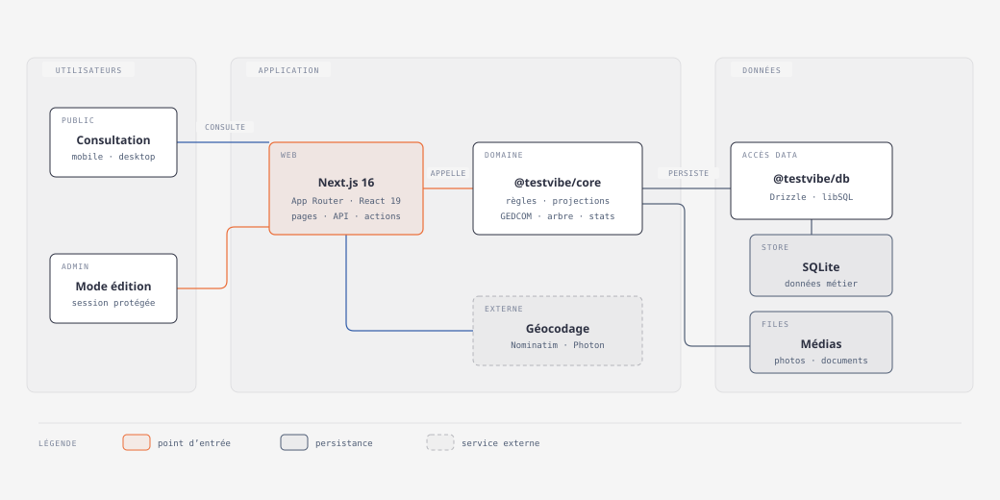
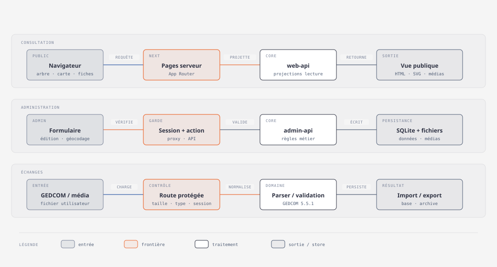

# TestVibe — arbre généalogique personnel

TestVibe est une application web auto-hébergeable pour consulter et administrer
une généalogie familiale. Le monorepo utilise Next.js 16, React 19, TypeScript,
Drizzle ORM et SQLite/libSQL.

## Fonctionnalités

- arbre interactif et liste des personnes, recherche et fiches individuelles ;
- carte des lieux, timeline familiale, anniversaires et statistiques ;
- administration des personnes, unions, filiations, événements et médias ;
- import et export GEDCOM 5.5.1 ;
- géocodage des lieux via Nominatim ou Photon.

Les écrans et actions d'administration sont protégés par une session serveur
fondée sur le secret configuré. Ce mécanisme convient à un usage personnel
maîtrisé, mais ne constitue pas un système complet de comptes utilisateurs.
Les requêtes de géocodage transmettent le lieu recherché au fournisseur externe.

## Architecture

```text
apps/web       Application Next.js (pages, actions serveur et routes API)
packages/core  Règles métier, projections, GEDCOM, arbre et statistiques
packages/db    Schéma et accès SQLite/libSQL avec Drizzle ORM
```



[Ouvrir la vue HTML de l'architecture](docs/architecture/system-architecture.html)



[Ouvrir la vue HTML des flux](docs/architecture/main-data-flows.html)

La base SQLite/libSQL contient les données métier. Les médias sont stockés dans
un répertoire distinct sur le système de fichiers.

## Démarrage local

Prérequis : Node.js 24 et pnpm 11.17.0 via Corepack. Les versions de référence
sont déclarées dans `.nvmrc` et `package.json`.

```bash
nvm install
nvm use
corepack enable
pnpm install --frozen-lockfile
pnpm db:migrate
pnpm dev
```

L'application est ensuite disponible sur `http://localhost:3000`.

## Configuration

Définissez les variables côté serveur dans votre environnement, sans les
committer :

| Variable | Rôle |
| --- | --- |
| `DATABASE_URL` | URL libSQL ou chemin du fichier SQLite persistant. |
| `ADMIN_SECRET` | Secret requis pour ouvrir la session d'administration. |
| `ADMIN_ORIGIN` | Origine canonique complète (par exemple `https://famille.example`) autorisée pour les mutations admin. |
| `UPLOAD_DIR` | Répertoire persistant des photos et documents. |
| `FAMILY_TIME_ZONE` | Fuseau IANA utilisé pour les dates familiales. |

Sans configuration explicite, le développement local utilise une base
`file:./local.db`, un répertoire `uploads` et le fuseau `Europe/Paris`. Aucun
secret d'administration n'est fourni par défaut.

## Qualité

Après l'installation figée, exécutez les contrôles dans cet ordre :

```bash
pnpm build
pnpm lint
pnpm test
```

## Déploiement

Le `Dockerfile` construit l'application Next.js et démarre `next start` sur le
port 3000. La CI construit les images de pull request et publie l'image de
production dans GitHub Container Registry (GHCR) après une release sur `main`.

Pour conserver les données entre les conteneurs, fournissez `DATABASE_URL` et
montez les emplacements de la base et de `UPLOAD_DIR` sur des volumes
persistants. Les migrations, sauvegardes, secrets, accès réseau et mises à jour
restent sous la responsabilité de l'opérateur.

## Limites

TestVibe vise une instance familiale personnelle : il n'offre ni gestion
multi-comptes ni synchronisation avec un service généalogique tiers. SQLite et
le stockage local des médias impliquent une stratégie de sauvegarde propre à
l'instance. Le rendu des diagrammes peut charger des polices Google externes.
